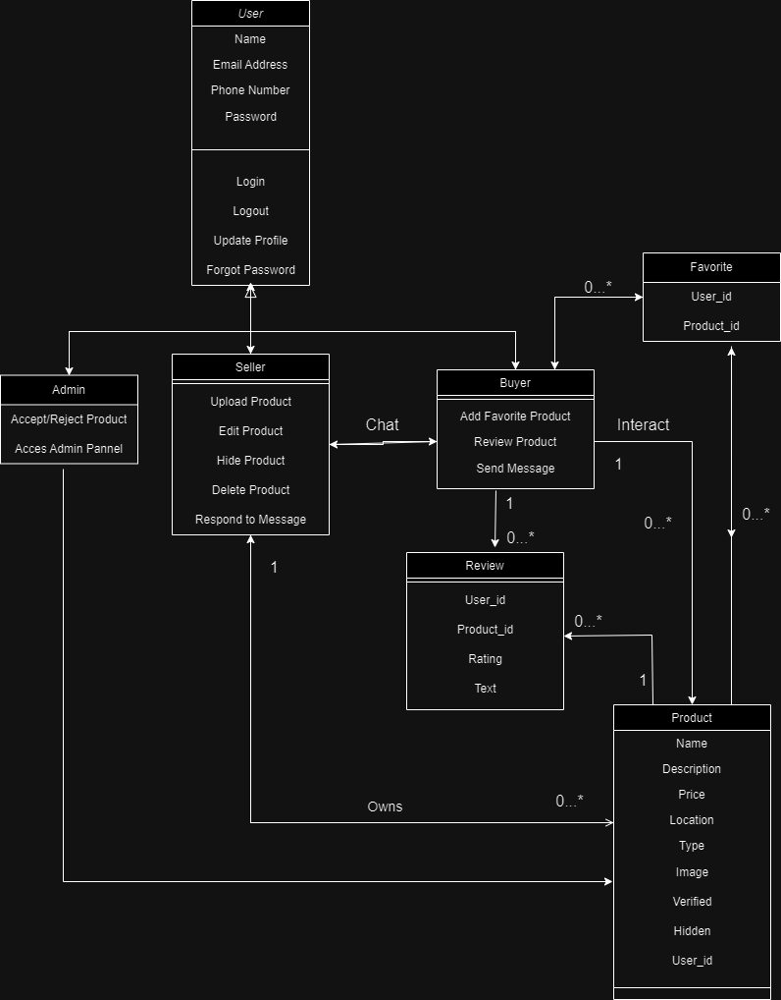
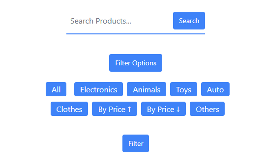
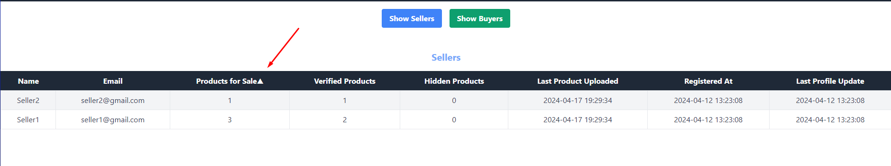
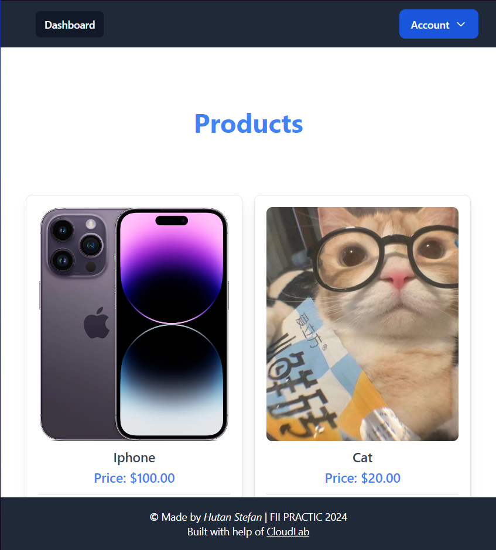

# Project made By Hutan Stefan | FII PRACTIC 2024

## **Built with help of [CloudLab](https://www.cloudlab-solutions.com)**

***

# Project Setup Guide

This guide will walk you through setting up the environment for the project.

## Prerequisites

- XAMPP installed on your system. If not installed, download and install it from [XAMPP](https://www.apachefriends.org/index.html).
- Composer installed on your system. If not installed, download and install it from [Composer](https://getcomposer.org/).
- Node.js installed on your system. If not installed, download and install it from [Node.js](https://nodejs.org/en/download/).

## Installation Steps

1. **Navigate to Project Directory:**

    ```bash
    cd /xampp/htdocs/project_name
    ```

2. **Check PHP Version:**

    ```bash
    php -v
    ```

    If PHP is not recognized, install XAMPP or Composer from [XAMPP](https://www.apachefriends.org/index.html) or [Composer](https://getcomposer.org/), respectively.

3. **Install Dependencies using Composer:**

    ```bash
    composer install
    ```

4. **Copy Environment Configuration:**

   
    Copy `.env.example.`
    Open the `.env` file, paste and adjust configurations such as port numbers, etc.

5. **Create Database Table:**

    - Open PHPMyAdmin and create a database named `project`.
    - Set the collation to `utf8_general_ci`.

6. **Run Database Migrations:**

    ```bash
    php artisan migrate
    ```

7. **Seed the Database:**

    ```bash
    php artisan db:seed
    ```    

8. **Install Vite using npm:**

    ```bash
    npm install vite --save-dev
    ```

9. **Compile Assets:**

    ```bash
    npm run dev
    ```

10. **Start the Server:**

    Run the following commands in separate terminals:

    ```bash
    php artisan serve
    ```

    ```bash
    npm run dev
    ```

Now, your project environment is set up and ready to go!


***


## UML Diagram: Project Structure



### Description

This UML diagram presents the structure of the project.

#### User Types:

- **Seller**
- **Buyer**
- **Admin**

#### Methods for All Users:

- **Login**: Allows users to log in to the system.
- **Register**: Enables users to create a new account.
- **Forget Password**: Provides a way for users to reset their password.
- **Update Account**: Allows users to update their account information within the system.
- **View Products**: Allows users to browse available products.

#### Methods for Seller:

- **Sell Product**: Enables the seller to list a new product for sale.
- **Edit Product**: Allows the seller to modify existing product details.
- **Hide Product**: Allows the seller to temporarily hide a product from the marketplace.
- **Delete Product**: Allows the seller to permanently remove a product from the marketplace.
- **Chat with Buyer**: Enables the seller to communicate with potential buyers.

#### Methods for Buyer:

- **Add to Favorite**: Allows the buyer to save products to their favorites list.
- **Review Product**: Enables the buyer to leave feedback and reviews as ratings for products.
- **Chat with Seller**: Allows the buyer to communicate with the seller of a product.

#### Methods for Admin:

- **Accept Product**: Allows the admin to approve product listings submitted by sellers.
- **Reject Product**: Allows the admin to reject product listings that do not meet the marketplace's criteria.
- **Admin Panel**: Provides access to administrative functionalities and settings.

#### Types of Relationships in the Project:

- **One-to-One (Tokens for Reset Password):**
  -  This relationship enables the backend to generate unique tokens for users who request to reset their passwords. Each token is generated per user request and is valid for a single password reset. This ensures secure verification and allows users to securely reset their passwords.

- **One-to-Many (Product Listings):**
  -  This relationship represents the association between sellers and their product listings. Each seller can have multiple product listings, but each product listing belongs to only one seller.
  
- **Many-to-Many (Favorite List):**
  -  This relationship allows users to create individual lists of favorite products. Users can add multiple products to their favorite lists, and each product can be favorited by multiple users. This enables users to curate their own personalized lists of preferred products, facilitating easy access and management of their favorite items.


***

# Other Website Functionalities

- **Search/Filter for Products**: Allows users to search for products based on specific criteria or apply filters to narrow down their search results.

- **Sort by Ascending/Descending in Admin Panel**: Enables administrators to sort data in the admin panel either in ascending or descending order by clicking the row, facilitating easier data management.

- **Responsive Design**: Ensures that the website is optimized to provide an optimal viewing and interaction experience across a wide range of devices and screen sizes, including desktops, laptops, tablets, and smartphones.



